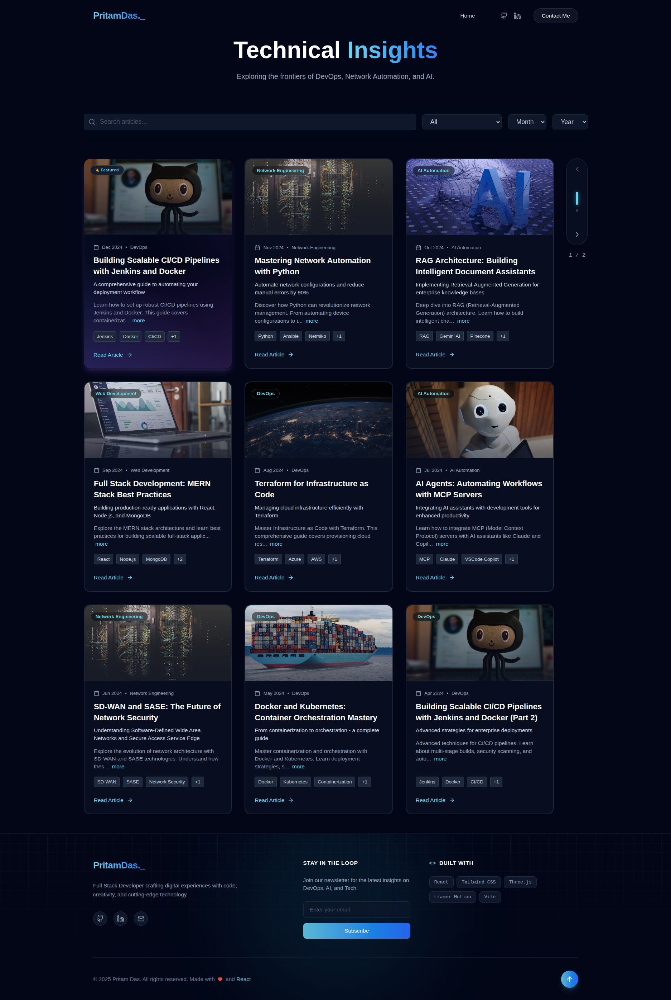
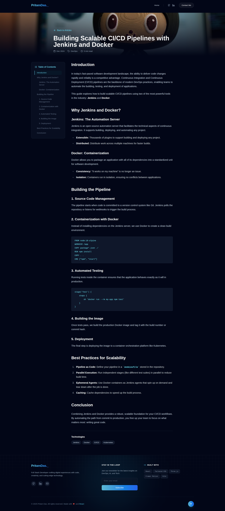
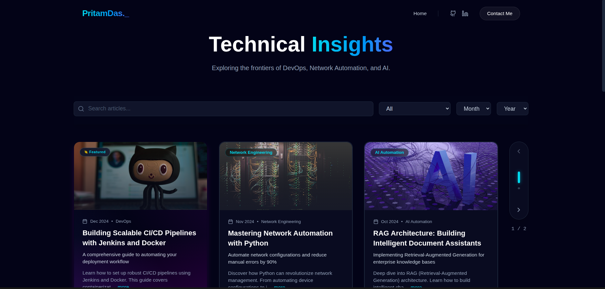
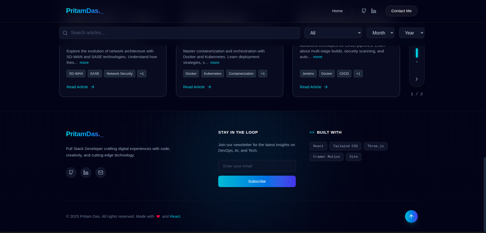
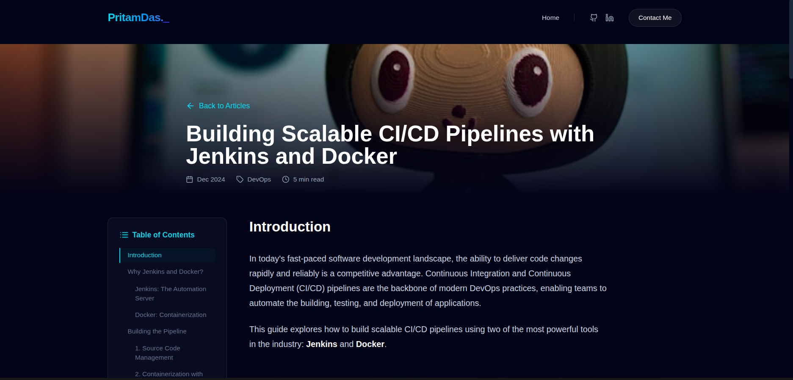
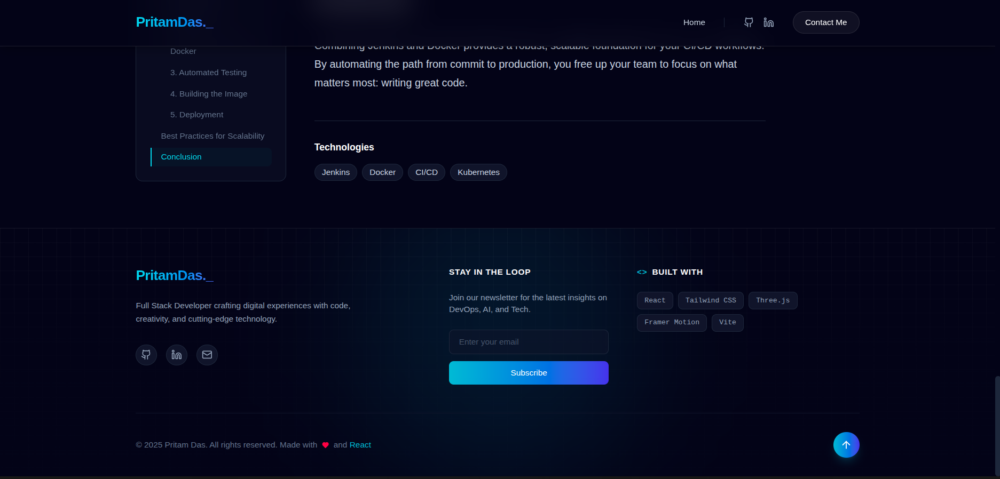

# 🎨 Technical Insights

A modern, responsive, and visually stunning personal blog built with React, Vite, and Tailwind CSS. This project showcases a clean design, smooth animations, and a seamless reading experience.

### Full Page Blog View : [Website](https://personal-blog-phi-henna.vercel.app/)



### Full Page Blog View : [Website](https://personal-blog-phi-henna.vercel.app/blog/scalable-cicd-pipelines)



## ✨ Features

- **Responsive Design**: Fully optimized for all device sizes, from mobile to desktop.
- **Modern UI/UX**: Clean aesthetic with glassmorphism effects and smooth transitions.
- **Dark Mode**: Easy on the eyes with a carefully crafted dark theme.
- **Markdown Support**: Renders blog posts written in Markdown with syntax highlighting.
- **Interactive Elements**: Engaging hover effects and animations using Framer Motion.
- **Category Filtering**: Easily filter blog posts by category.

## 🛠️ Tech Stack

- **Frontend Framework**: [React](https://react.dev/)
- **Build Tool**: [Vite](https://vitejs.dev/)
- **Styling**: [Tailwind CSS](https://tailwindcss.com/)
- **Animations**: [Framer Motion](https://www.framer.com/motion/)
- **Icons**: [Lucide React](https://lucide.dev/)
- **Routing**: [React Router](https://reactrouter.com/)
- **Markdown Rendering**: [React Markdown](https://github.com/remarkjs/react-markdown)

## 📸 Gallery

Here's a glimpse into the application:

| Home Page | Blog Details |
|:---:|:---:|
|  |  |

| Blog Page | Dark Mode |
|:---:|:---:|
|  |  |

| Mobile View |
|:---:|
|  |

## 🚀 Installation & Usage

Follow these steps to get the project running locally:

1.  **Clone the repository**
    ```bash
    git clone https://github.com/yourusername/personal-blog.git
    cd personal-blog
    ```

2.  **Install dependencies**
    ```bash
    npm install
    ```

3.  **Start the development server**
    ```bash
    npm run dev
    ```

4.  **Build for production**
    ```bash
    npm run build
    ```

## 🤝 Contributing

Contributions are welcome! Please feel free to submit a Pull Request.


